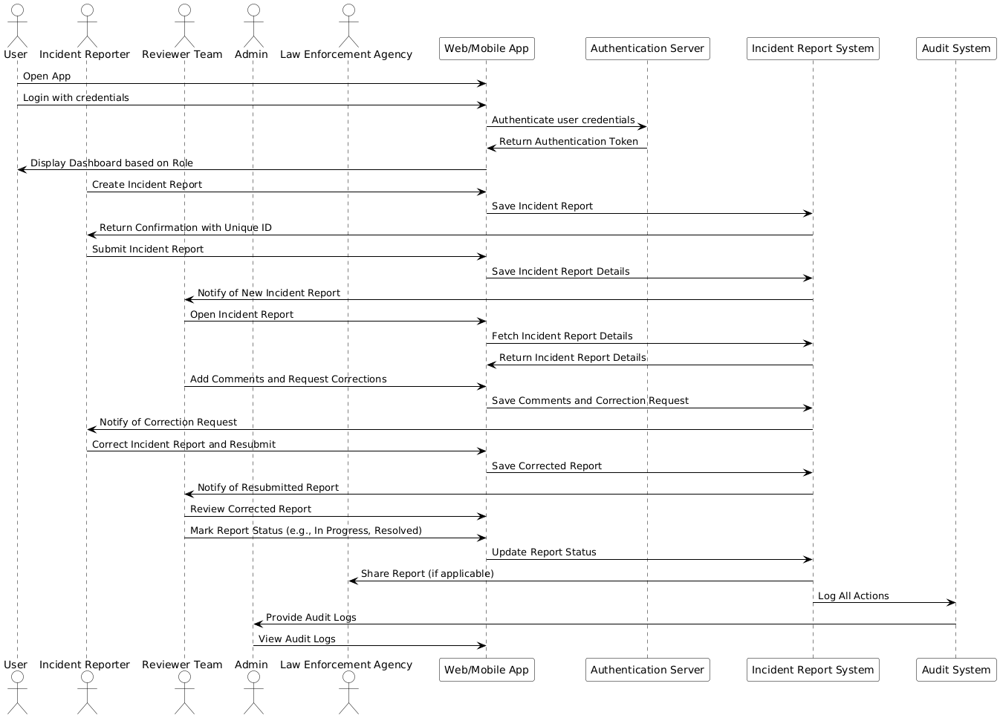

# Incident Report Automation Workflow

## Overview
This repository showcases my expertise in automating business processes, specifically focusing on incident report procedures in a business setting. Created as part of an assessment during a hiring process, this project highlights my ability to design and document workflows, acceptance criteria, and sequence diagrams for complex systems.

## Project Highlights
- **Use Case:** Automation of incident reporting where management teams document incidents, review the events, and take immediate action. This system is designed to streamline the recording, preservation, and dissemination of information to relevant teams and law enforcement as required.
- **Objective:** Demonstrate my capability to create an efficient, reliable, and scalable workflow that addresses the needs of a modern business environment.

## Contents
- **Acceptance Criteria:** Detailed conditions that define the successful implementation of the automated workflow. This section ensures that all critical aspects of the incident reporting process are covered, from initial report creation to action taking. [View or Download the Acceptance Criteria PDF](Acceptance%20Criteria.pdf)
- **BPMN Diagram:** A visual representation of the entire incident reporting process, showcasing the steps involved and how they interact within the automated system. 
- **Sequence Diagram:** An illustration of the sequence of interactions and processes that occur during the incident reporting procedure, ensuring clarity in the flow of information and actions. 
- **Wireframes:** Interactive wireframes that demonstrate the user interface for the incident report automation system. [View the Wireframes in Figma](https://www.figma.com/proto/hjCSReQ7JaHQ1nOlcyGBW2/Incident-Report-Automation-Wireframes?node-id=1-10&t=6f825IPqxWj31GfG-1)

## How This Project Demonstrates My Skills
- **Business Process Automation:** The project highlights my ability to identify process gaps and design workflows that improve efficiency and accuracy in reporting.
- **Documentation:** It demonstrates my proficiency in creating detailed documentation that can be easily understood and implemented by technical teams.
- **Systems Thinking:** The project reflects my ability to think holistically about how different parts of a system interact and how to design processes that work seamlessly together.
- **Stakeholder Communication:** My ability to translate complex technical requirements into clear, actionable items for both technical and non-technical stakeholders is evident in this project.
